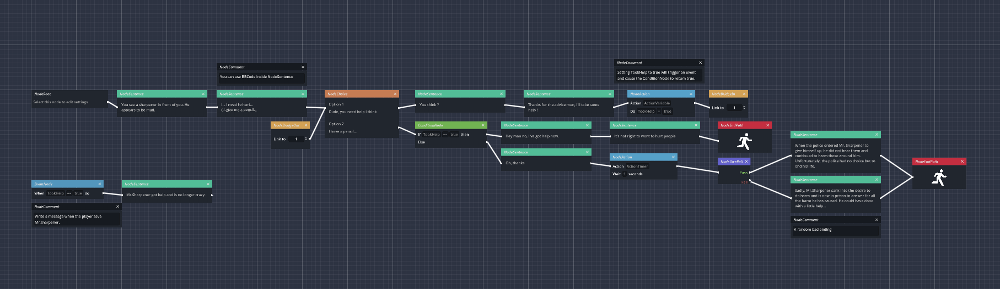

# Monologue is a powerful non-linear dialogue editor made for any game engine. 🦖

*You can find the wiki [here](https://github.com/atomic-junky/Monologue/wiki).*


Monologue is a graph node based system dialogue editor that allows you to create modular and non-linear dialogues in any game engine.

The principle of Monologue is to assign a unique ID to each node, so that any node can refer to any other node. This powerful mechanism allows you to create amazing dialogues and stories.



## Super Simple export
Monologue is working with just a simple JSON file and nothing else. You just need to save your chnages and it will update your JSON file.

The advantage of working with a JSON file is that it's easy to use with any other game engine or programming language.


## Features
- Easy to use: A simple and intuitive user interface.
- JSON: Everything is stored in a JSON file.
- Godot: Monologue is built using a free and open source game engine.
- Manage everything: Control audio, backgrounds and characters.
- Variables: You can define variables, compare them and update their values.
- Events: You create events to execute storylines when something happens.
- Test: You can test your story directly in Monologue.


## The JSON file format
```json
{
	"EditorVersion": "",
	"RootNodeId": "", # The id of the root node (where all start)
	"ListNodes": [ # Where all the nodes are stored
		...
	],
	"Characters": [ # All the characters
		...
	],
	"Variables": [ # All the variables
		...
	]
}
```


## Interpretation
You can write your own script or use the **MonologueProcess** script [here](https://github.com/atomic-junky/Monologue/blob/main/Test/Scripts/MonologueProcess.gd) if you're using Godot.

To use the MonologueProcess script, create a script that extends MonologueProcess. This will allow you to use the built-in signals. You can read more about this in [this script](https://github.com/atomic-junky/Monologue/blob/main/Test/Scripts/Main.gd).


## Credits ans Support
This project is originally from Amberlim (although these two projects no longer share any lines of code), so if you want, here is her [Discord server](https://discord.gg/AAcKmJz7Na). However, if you need help, don't hesitate to create an issue on Github.
