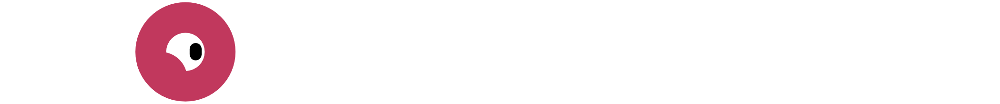

Monologue is a dynamic, flexible and open-source dialogue editor designed for creating non-linear dialogues in games.

## Features

- **Easy to use:** Simple and modern UI.
- **Flexible:** Monologue lets you create dynamic and non-linear storylines.
- **Manage everything:** Control audio, backgrounds and characters.
- **Nodes:** Each stage of your dialogues is defined by a node with specific characteristics and tasks.
- **In-app execution:** Run your story directly inside Monologue and from the node you want.

## Versioning

Releases are numbered with the [semantic versioning](http://semver.org/) format: `<major>.<minor>.<patch>` and constructed with the following guidelines:

- Breaking backwards compatibility bumps the major
- New additions without breaking backwards compatibility bumps the minor
- Bug fixes and misc changes bump the patch

## Credits

Made by [Atomic Junky](https://github.com/atomic-junky/).  
With the contribution of [RailKill](https://github.com/RailKill) and [Jeremi Biernacki](https://github.com/Jeremi360).

Monologue was originally a fork of [Amberlim's GodotDialogSystem](https://github.com/Amberlim/GodotDialogSystem).

## License

This project is licensed under the terms of the [MIT license](https://github.com/atomic-junky/Monologue/blob/main/LICENSE).
